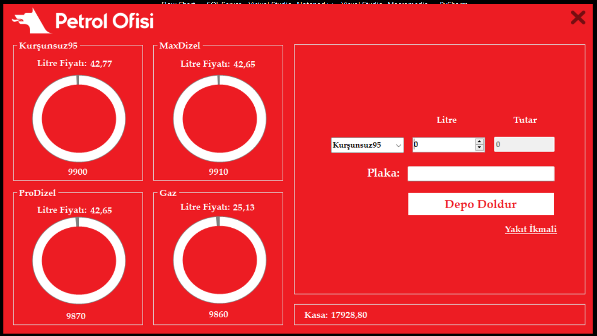
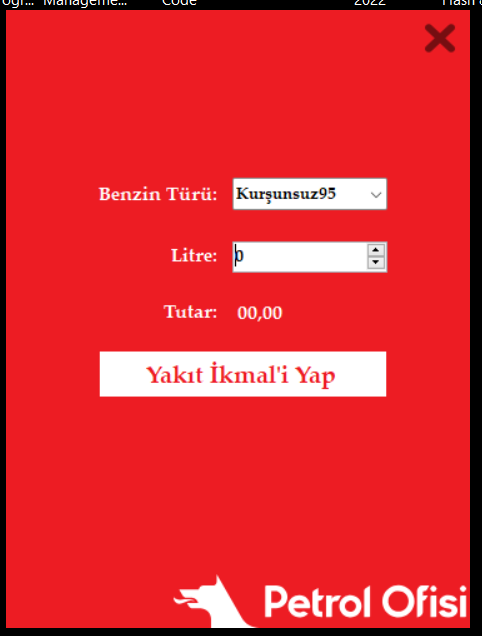

# Petrol Stok Takip Uygulaması
## Proje açıklaması
Bu proje benzin dolumu yapılacak olan arabaların verilerinin tutulduğu bir masaüstü uygulamasıdır. Veritabanında; Benzin türüne göre litre fiyatları ve stokta olan petrol miktarları tutulmaktadır. Benzin alan araçlar için; plaka, alınan litre, tutan miktar hareket tablosunda saklanmaktadır. Stokta benzin kalmaması durumunda yakıt ikmali yapılabilir, alış fiyatı üzerinden hesaplanacak tutar kasadan düşmektedir.
## Önizleme
**Ana Ekran**

**Yakıt İkmali**

## Kullanılan Teknolojiler
Projede aşağıdaki teknolojiler kullanılmaktadır:

- MSSQL
- C#
- .NET Framework

## Yazarlar
- [Muhammed Mustafa Demirhan](https://github.com/MuhammedMustafaDemirhan) - Projeyi geliştiren
